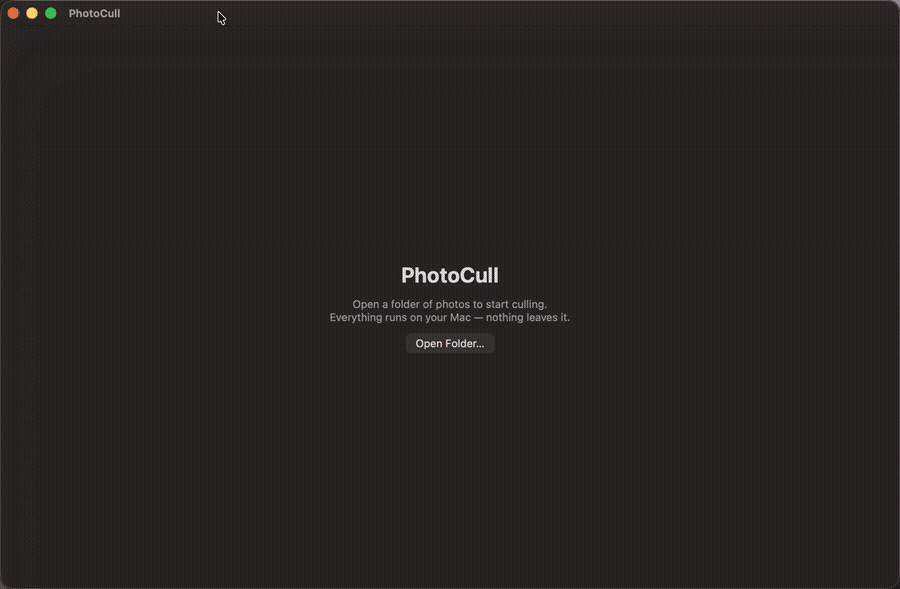

# PhotoCull

**AI photo culling for macOS — free, open source, 100% on-device.**

Sort thousands of photos after a shoot in minutes: PhotoCull flags blurry
shots and closed eyes, groups bursts, and suggests the best frame of each —
entirely on your Mac. No cloud, no account, no subscription.

> Tools like Aftershoot and Narrative Select charge $10–30/month to do this
> in the cloud. PhotoCull does it locally with Apple's Vision framework, for $0.



## Features

- **Blur detection** — laplacian sharpness scoring per photo
- **Closed-eyes detection** — on-device face landmark analysis
- **Burst grouping** — EXIF time + visual similarity, best frame suggested
- **Smart suggestions** — analysis pre-fills suggested keep/reject decisions;
  you scan and adjust instead of deciding from scratch
- **Momentum built in** — a progress meter that counts your finished analysis
  as step one, with live kept/rejected/to-go tallies
- **Keyboard-first review** — `K` keep, `X` reject, arrows to navigate
- **Results before any ask** — no account, no upload, no paywall; the full
  report is yours the moment analysis ends
- **Non-destructive output** — move rejects to `_rejects/`, or write
  **XMP sidecars** that Lightroom Classic reads directly (cull here, edit there)
- **Both Lightrooms supported** — XMP sidecars for Lightroom Classic, and
  "Export Keepers" for Lightroom (cloud): JPEG/HEIC copies get the rating
  embedded in the file header; RAW copies come with an XMP sidecar (Lightroom
  cloud applies its develop metadata from sidecars — rating pickup varies by
  version). Originals are never touched.
- **Private by design** — zero network calls, zero telemetry

## Install

```sh
brew install --cask theodorebeaupre-prog/tap/photocull
```

Or build from source:

```sh
git clone https://github.com/theodorebeaupre-prog/photocull && cd photocull
brew install xcodegen
xcodegen generate
xcodebuild -project PhotoCull.xcodeproj -scheme PhotoCull -configuration Release build
```

## vs. paid tools

|                      | PhotoCull | Aftershoot | Narrative Select |
|----------------------|-----------|------------|------------------|
| Price                | **Free**  | $10+/mo    | $18+/mo          |
| Runs offline         | **Yes**   | Partial    | Partial          |
| Open source          | **Yes**   | No         | No               |
| Your photos stay home| **Yes**   | No         | No               |

## Requirements

macOS 14.0+.

## License

MIT © ISO NORD CA
